# ETL Project with Spotify API, Lambda, CloudWatch, S3, Snowflake & Power BI:

In my data engineering project, I use **CloudWatch** and **AWS Lambda** in **Python** to extract data from the **Spotify API** weekly and store it in an **S3 bucket**. 

A second **Lambda** function transforms the raw **JSON** data into **CSV**, which is saved in another **S3 bucket**. 

**Snowpipe** loads transformed data from the Staging layer into fact and dimension tables in **Snowflake**. The processed data is then used in a **Power BI dashboard**, providing **(1)** an analysis of Spotify's global Top 50 playlist and **(2)** a detailed breakdown of the most popular songs by the artists in the playlist.

That's the data architecture of the project:

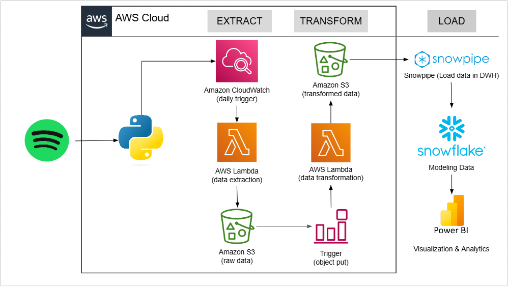

## Bucket on AWS S3:

First, I created the **spotify-etl-project-jv** **S3 bucket** to store the extractions and transformations of semi-structured data from the **Spotify API**.

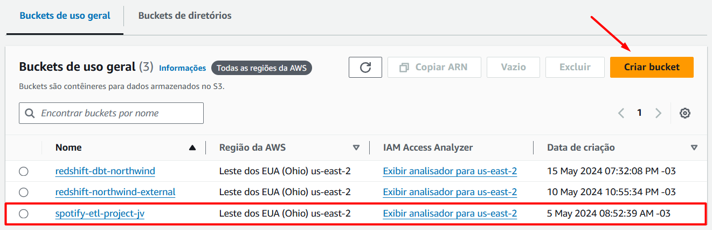

Next, I created two folders in the **bucket**: **processed**, for storing processed and transformed **JSON** files from the **Spotify API**, and **to_processed**, for new **JSON** files to be processed by the **AWS Lambda** function in **Python**.

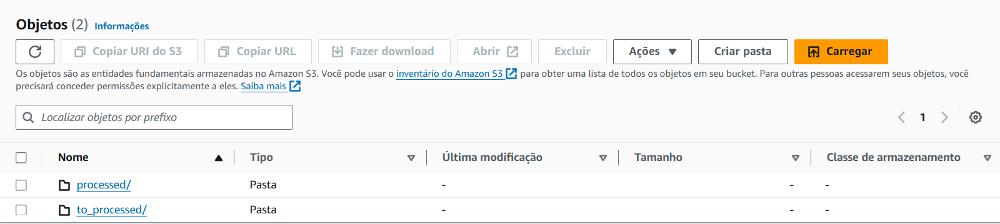

The **processed** and **to_processed** folders contain two subfolders: **data_playlist_tracks_raw**, for raw **JSON** data of the Top 50 global playlist, and **top_tracks_artist_raw**, for raw **JSON** data of the hit history of artists in the playlist.

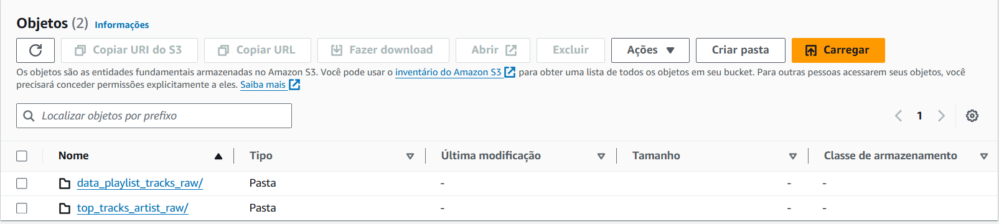

Below is an example of raw **JSON** files extracted from the **Spotify API** and stored in the **processed** folder of the **S3 bucket**:

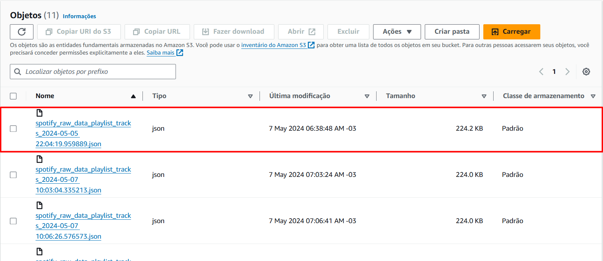

## Functions in AWS Lambda:

#### Data Extraction from the Spotify API:

In the data extraction phase from the **Spotify API**, I built a **Pipeline** in **AWS Lambda** that uses **(1) CloudWatch** to trigger a **Python Lambda** function. 

This function extracts data from the **Spotify API** and saves it in **JSON** format in the **to_processed** folder of the **spotify-etl-project-jv** **S3 bucket**.

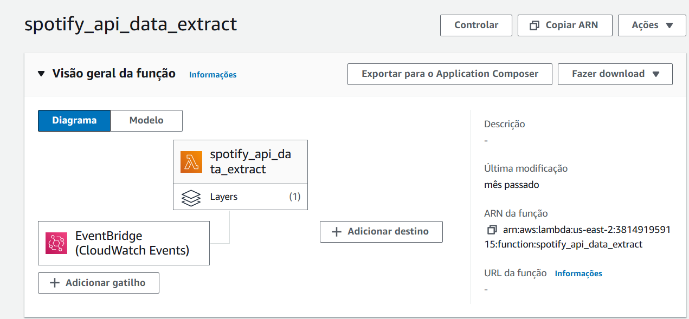

I configured the **CloudWatch trigger** to run the **Lambda** function for extracting data from the **Spotify API** on a weekly basis.

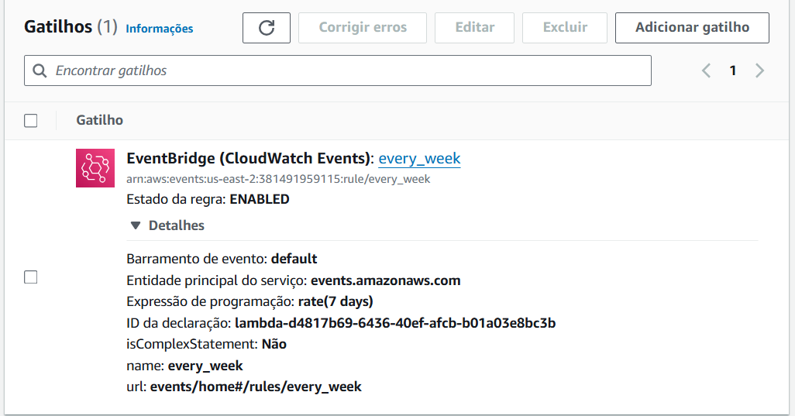

To execute the **Lambda** function for data extraction, I configured environment variables to store the **Spotify API** access secrets and added the **spotipy** package layer, enabling **AWS Lambda** to use the library for connecting to the **Spotify API**.

**Environment Variables** 

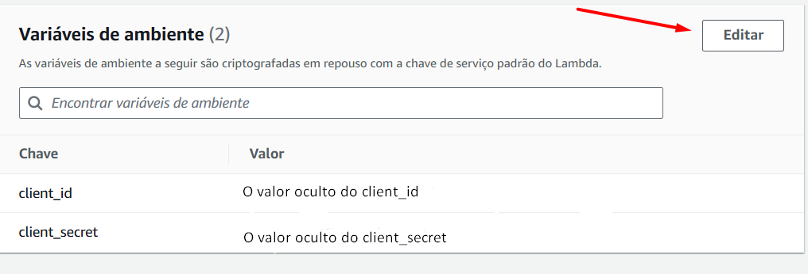

**Spotipy Package**

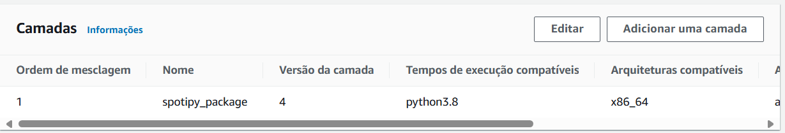

Finally, I deployed the **Python** code in **AWS Lambda** to extract raw and semi-structured **JSON** data for the **Top 50 Global playlist** and the **hit tracks** of the artists in that playlist.

```
import json
import os
import spotipy
from spotipy.oauth2 import SpotifyClientCredentials
import boto3
from datetime import datetime

def lambda_handler(event, context):
    
    client_id = os.environ.get('client_id')
    client_secret = os.environ.get('client_secret')
    
    client_credentials_manager = SpotifyClientCredentials(
    client_id = client_id,
    client_secret = client_secret
        )
        
    sp = spotipy.Spotify(client_credentials_manager = client_credentials_manager)
    
    playlist_link = 'https://open.spotify.com/playlist/37i9dQZEVXbMDoHDwVN2tF'
    playlist_URI = playlist_link.split('/')[-1]
    data_playlist_tracks = sp.playlist_tracks(playlist_URI)
    
    client = boto3.client('s3')
    
    artists_ids = []
    for row in data_playlist_tracks['items']:
        for key, value in row.items():
            if key == 'track':
                for artist in value['artists']:
                    artist_id = artist['id']
                    artists_ids.append(artist_id)
                    
    for artist in set(artists_ids):
        
        data_top_tracks_artist = sp.artist_top_tracks(artist)
        
        filename = 'raw_data_top_tracks_artist_' + artist + '_' + str(datetime.now()) + '.json'
        
        client.put_object(
            Bucket = 'spotify-etl-project-jv',
            Key = 'raw_data/to_processed/top_tracks_artist_raw/' + filename,
            Body = json.dumps(data_top_tracks_artist)
            
            )
        
    filename = 'spotify_raw_data_playlist_tracks_' + str(datetime.now()) + '.json'
    
    client.put_object(
        Bucket = 'spotify-etl-project-jv',
        Key = 'raw_data/to_processed/data_playlist_tracks_raw/' + filename,
        Body = json.dumps(data_playlist_tracks)
        )
```
#### Data Transformation from the Spotify API

In the second phase, I created a **Pipeline** in **AWS Lambda** to transform data from the **Spotify API** whenever new **JSON** files are uploaded to the **to_processed** folder in the **S3 bucket**. 

The **Lambda trigger** is an event that detects the creation of new **JSON** files in this folder, signaling that data is ready for processing and transformation:

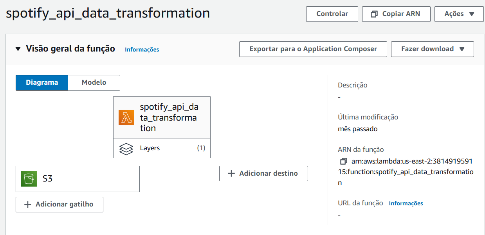

I configured an **S3 event trigger** to execute the **Lambda** function for transforming data from the **Spotify API** whenever new **JSON** files are uploaded to the **to_processed** folder:

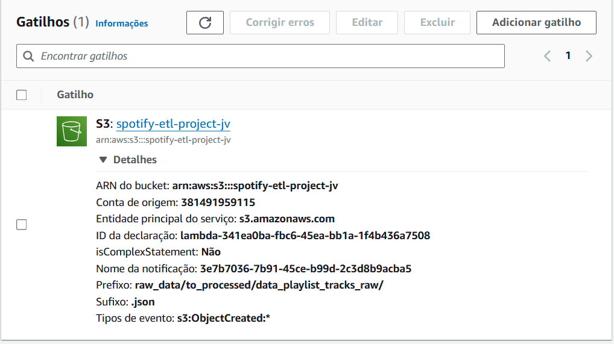

To execute the **Lambda** function for data transformation, I added a **Pandas** package layer to **AWS Lambda**, enabling the use of the **Pandas** library to manipulate and transform data from the **Spotify API**.

**Pandas Package**

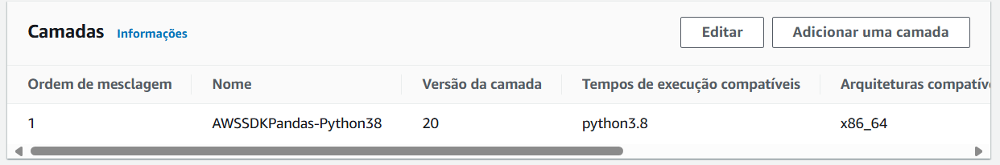

Next, I deployed the **Python** code in **AWS Lambda** to transform the raw and semi-structured data from the **Top 50 Global playlist** and the **hit tracks** of the artists in the playlist. The code normalizes the **JSON** data into a tabular **CSV** format and saves the transformed data in the **transformed_data** folder of the **S3 bucket**:

```
import json
import boto3
import pandas as pd
from datetime import datetime
import os
from io import StringIO

def albums(data):
    album_list = []
    for row in data['items']:
    
        album_id = row['track']['album']['id']
        album_name = row['track']['album']['name']
        album_release_date = row['track']['album']['release_date']
        album_total_tracks = row['track']['album']['total_tracks']
        album_external_urls = row['track']['album']['external_urls']['spotify']
        album_element = {
                'album_id': album_id, 'album_name': album_name, 'album_release_date': album_release_date,
                'album_total_tracks': album_total_tracks, 'album_external_urls': album_external_urls
                }
        album_list.append(album_element)
    
    return album_list
    
def artists(data):
    artist_list = []
    for row in data['items']:
        for key, value in row.items():
            if key == 'track':
                for artist in value['artists']:
                    artist_dict = {'artist_id': artist['id'], 'artist_name': artist['name'], 'external_urls': artist['external_urls']['spotify']}
                    artist_list.append(artist_dict)
                    
    return artist_list
    
def songs(data):
    song_list = []
    for row in data['items']:
        song_id = row['track']['id']
        song_name = row['track']['name']
        song_duration_ms = row['track']['duration_ms']
        song_url = row['track']['external_urls']['spotify']
        song_popularity = row['track']['popularity']
        song_added = row['added_at']
        album_id = row['track']['album']['id']
        artist_id = row['track']['album']['artists'][0]['id']
        song_element = {'song_id': song_id, 'song_name': song_name, 'song_duration_ms': song_duration_ms,
                       'song_url': song_url, 'song_popularity': song_popularity, 'song_added': song_added,
                       'album_id': album_id, 'artist_id': artist_id}
        song_list.append(song_element)
        
    return song_list

def top_tracks_artist(data):
    
    top_tracks_artist_list = []
    
    for top_track in data['tracks']:
        
        artist_id = top_track['artists'][0]['id']
        artist_name = top_track['artists'][0]['name']
        track_name = top_track['name']
        popularity = top_track['popularity']
        duration_ms = top_track['duration_ms']
        song_id = top_track['id']
        album_name = top_track['album']['name']
        total_tracks = top_track['album']['total_tracks']
        album_id = top_track['album']['id']
        release_date = top_track['album']['release_date']
        image_album = top_track['album']['images'][0]['url']
        external_url = top_track['external_urls']['spotify']
        top_tracks_artist = {
            'artist_id': artist_id, 'artist_name': artist_name, 'track_name': track_name, 'popularity': popularity,
            'duration_ms': duration_ms, 'song_id': song_id, 'album_name': album_name, 'total_tracks': total_tracks,
            'album_id': album_id, 'release_date': release_date, 'image_album': image_album, 'external_url': external_url
        }
        
        top_tracks_artist_list.append(top_tracks_artist)
        
    return top_tracks_artist_list


def lambda_handler(event, context):
    
    s3 = boto3.client('s3')
    Bucket = 'spotify-etl-project-jv'

    transformed_data_keys = [
        'transformed_data/song_data/',
        'transformed_data/artist_data/',
        'transformed_data/album_data/',
        'transformed_data/top_tracks_artist_data/'
    ]
    
    for key_prefix in transformed_data_keys:
        objects_to_delete = s3.list_objects(Bucket=Bucket, Prefix=key_prefix).get('Contents', [])
        for obj in objects_to_delete:
            if obj['Key'].endswith('.csv'):
                s3.delete_object(Bucket=Bucket, Key=obj['Key'])


    key_data_playlist_tracks_raw = 'raw_data/to_processed/data_playlist_tracks_raw/'
    key_data_top_tracks_artist = 'raw_data/to_processed/top_tracks_artist_raw/'
    
    spotify_playlist_tracks_data = []
    spotify_playlist_tracks_key = []
    
    spotify_top_tracks_artist_data = []
    spotify_top_tracks_artist_key = []
    
    for file_playlist_tracks in s3.list_objects(Bucket = Bucket, Prefix = key_data_playlist_tracks_raw)['Contents']:
        
        file_playlist_track_key = file_playlist_tracks['Key']

        if (file_playlist_track_key.split('.')[-1] == 'json'):
            
            response = s3.get_object(Bucket = Bucket, Key = file_playlist_track_key)
            content = response['Body']
            jsonObject = json.loads(content.read())
            spotify_playlist_tracks_data.append(jsonObject)
            spotify_playlist_tracks_key.append(file_playlist_track_key)
    
    for file_top_tracks_artist in s3.list_objects(Bucket = Bucket, Prefix = key_data_top_tracks_artist)['Contents']:
        
        file_top_tracks_artist_key = file_top_tracks_artist['Key']

        if (file_top_tracks_artist_key.split('.')[-1] == 'json'):
            
            response = s3.get_object(Bucket = Bucket, Key = file_top_tracks_artist_key)
            content = response['Body']
            jsonObject = json.loads(content.read())
            spotify_top_tracks_artist_data.append(jsonObject)
            spotify_top_tracks_artist_key.append(file_top_tracks_artist_key)    
            
    for data in spotify_playlist_tracks_data:
        
        album_list = albums(data)
        song_list = songs(data)
        artist_list = artists(data)

        album_df = pd.DataFrame.from_dict(album_list)
        album_df = album_df.applymap(lambda x: x.strip().replace('"', '') if isinstance(x, str) else x)
        album_df = album_df.drop_duplicates(subset = ['album_id'])
        
        artist_df = pd.DataFrame.from_dict(artist_list)
        artist_df = artist_df.applymap(lambda x: x.strip().replace('"', '') if isinstance(x, str) else x)
        artist_df = artist_df.drop_duplicates(subset = ['artist_id'])
        
        song_df = pd.DataFrame.from_dict(song_list)
        song_df = song_df.applymap(lambda x: x.strip().replace('"', '') if isinstance(x, str) else x)
        song_df = song_df.drop_duplicates()

        album_df['album_release_date'] = pd.to_datetime(album_df['album_release_date'], errors = 'coerce')
        song_df['song_added'] = pd.to_datetime(song_df['song_added'], errors = 'coerce')
        
        song_key = 'transformed_data/song_data/songs_transformed_' + str(datetime.now()) + '.csv'
        song_buffer = StringIO()
        song_df.to_csv(song_buffer, index = False, sep = ';')
        song_content = song_buffer.getvalue()
        s3.put_object(Bucket = Bucket, Key = song_key, Body = song_content)
        
        artist_key = 'transformed_data/artist_data/artist_transformed_' + str(datetime.now()) + '.csv'
        artist_buffer = StringIO()
        artist_df.to_csv(artist_buffer, index = False, sep = ';')
        artist_content = artist_buffer.getvalue()
        s3.put_object(Bucket = Bucket, Key = artist_key, Body = artist_content)
        
        album_key = 'transformed_data/album_data/album_transformed_' + str(datetime.now()) + '.csv'
        album_buffer = StringIO()
        album_df.to_csv(album_buffer, index = False, sep = ';')
        album_content = album_buffer.getvalue()
        s3.put_object(Bucket = Bucket, Key = album_key, Body = album_content)
        
    concatenated_top_tracks_artist_df = pd.DataFrame()
        
    for data in spotify_top_tracks_artist_data:
        
        top_tracks_artist_list = top_tracks_artist(data)
        
        top_tracks_artist_df = pd.DataFrame.from_dict(top_tracks_artist_list)
        
        concatenated_top_tracks_artist_df = pd.concat([concatenated_top_tracks_artist_df, top_tracks_artist_df])
        concatenated_top_tracks_artist_df = concatenated_top_tracks_artist_df.applymap(lambda x: x.strip().replace('"', '') if isinstance(x, str) else x)
        concatenated_top_tracks_artist_df = concatenated_top_tracks_artist_df.drop_duplicates()
        
    top_tracks_artist_key = 'transformed_data/top_tracks_artist_data/top_tracks_artist_transformed_' + str(datetime.now()) + '.csv'
    top_tracks_artist_buffer = StringIO()
    concatenated_top_tracks_artist_df.to_csv(top_tracks_artist_buffer, index = False, sep = ';')
    top_tracks_artist_content = top_tracks_artist_buffer.getvalue()
    s3.put_object(Bucket = Bucket, Key = top_tracks_artist_key, Body = top_tracks_artist_content)
        
    s3_resource = boto3.resource('s3')
    
    for key in spotify_playlist_tracks_key:
        
        copy_source = {
            'Bucket': Bucket,
            'Key': key
        }
        
        s3_resource.meta.client.copy(copy_source, Bucket, 'raw_data/processed/data_playlist_tracks_raw/' + key.split('/')[-1])
        s3_resource.Object(Bucket, key).delete()
        
    for key in spotify_top_tracks_artist_key:
        
        copy_source = {
            'Bucket': Bucket,
            'Key': key
        }
        
        s3_resource.meta.client.copy(copy_source, Bucket, 'raw_data/processed/top_tracks_artist_raw/' + key.split('/')[-1])
        s3_resource.Object(Bucket, key).delete()
```
In the **transformed_data** folder, the **CSV** files are organized into subfolders in the **S3 bucket**, separated into **albums**, **artists**, **tracks**, and **artist hits** files:

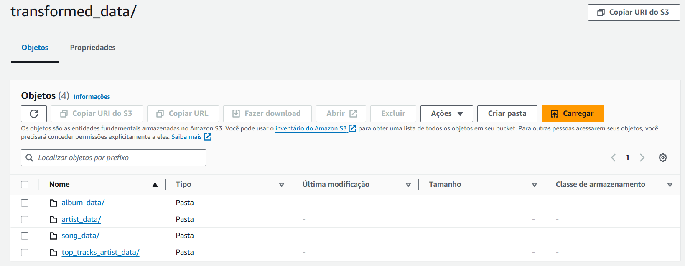

## DWH in Snowflake:

Then, I configured **Snowpipe** in **Snowflake** to load the processed data from the Staging layer, specifically the **CSV** files from the **transformed_data** folder, into the fact table and dimension tables in the **Snowflake Schema** model of the **Spotify DWH**.

Creation of the **Spotify Database** and **Schemas** for the Fact Table and Dimension Tables in the **DWH**:

```
CREATE OR REPLACE DATABASE SPOTIFY_DWH;

CREATE OR REPLACE SCHEMA SPOTIFY_DWH.FACT;
CREATE OR REPLACE SCHEMA SPOTIFY_DWH.DIMENSION;
```

Dimension tables **songs**, **artists** e **album**:

```
CREATE OR REPLACE TABLE SPOTIFY_DWH.DIMENSION.ALBUM (
    album_id STRING NOT NULL,
    album_name STRING,
    album_release_date DATE,
    album_total_tracks INTEGER,
    album_external_urls STRING
);

CREATE OR REPLACE TABLE SPOTIFY_DWH.DIMENSION.SONG (
    song_id STRING NOT NULL,
    song_name STRING,
    song_duration_ms INTEGER,
    song_url STRING,
    song_popularity INTEGER,
    song_added TIMESTAMP_NTZ,
    album_id STRING,
    artist_id STRING
);


CREATE OR REPLACE TABLE SPOTIFY_DWH.DIMENSION.ARTISTS (
    artist_id STRING NOT NULL,
    artist_name STRING,
    external_urls STRING
);
```
Fact table **top_tracks_artist**:

```
CREATE OR REPLACE TABLE SPOTIFY_DWH.FACT.TOP_TRACKS_ARTIST (
    artist_id STRING,
    artist_name STRING,
    track_name STRING,
    popularity INTEGER,
    duration_ms INTEGER,
    song_id STRING,
    album_name STRING,
    total_tracks INTEGER,
    album_id STRING,
    release_date DATE,
    image_album STRING,
    external_url STRING
    );
```
**Storage Integration** with the **transformed_data** folder in the **S3 bucket**, definition of the **CSV** file format, and Staging layer configuration for the **DWH**:
```
CREATE OR REPLACE FILE FORMAT MANAGE_DB.FILE_FORMATS.CSV_FILE_FORMAT
    TYPE = CSV,
    FIELD_DELIMITER = ';',
    SKIP_HEADER = 1,
    ERROR_ON_COLUMN_COUNT_MISMATCH = FALSE;

CREATE OR REPLACE STORAGE INTEGRATION s3_spotify_transformed_data
    TYPE = EXTERNAL_STAGE
    STORAGE_PROVIDER = S3
    ENABLED = TRUE
    STORAGE_AWS_ROLE_ARN = 'arn:aws:iam::381491959115:role/snowflake-s3-storage-integration'
    STORAGE_ALLOWED_LOCATIONS = ('s3://spotify-etl-project-jv/transformed_data/')
        COMMENT = 'Creating connection to S3 bucket with the Spotify data cleansed';

CREATE OR REPLACE SCHEMA MANAGE_DB.EXTERNAL_STAGES;

CREATE OR REPLACE STAGE MANAGE_DB.EXTERNAL_STAGES.ALBUM_DATA
    URL = 's3://spotify-etl-project-jv/transformed_data/album_data/'
    STORAGE_INTEGRATION = s3_spotify_transformed_data
    FILE_FORMAT = MANAGE_DB.FILE_FORMATS.CSV_FILE_FORMAT
    DIRECTORY = (ENABLE = TRUE AUTO_REFRESH = TRUE);

CREATE OR REPLACE STAGE MANAGE_DB.EXTERNAL_STAGES.SONG_DATA
    URL = 's3://spotify-etl-project-jv/transformed_data/song_data/'
    STORAGE_INTEGRATION = s3_spotify_transformed_data
    FILE_FORMAT = MANAGE_DB.FILE_FORMATS.CSV_FILE_FORMAT
    DIRECTORY = (ENABLE = TRUE AUTO_REFRESH = TRUE);

CREATE OR REPLACE STAGE MANAGE_DB.EXTERNAL_STAGES.ARTIST_DATA
    URL = 's3://spotify-etl-project-jv/transformed_data/artist_data/'
    STORAGE_INTEGRATION = s3_spotify_transformed_data
    FILE_FORMAT = MANAGE_DB.FILE_FORMATS.CSV_FILE_FORMAT
    DIRECTORY = (ENABLE = TRUE AUTO_REFRESH = TRUE);
    
CREATE OR REPLACE STAGE MANAGE_DB.EXTERNAL_STAGES.TOP_TRACKS_ARTIST_DATA
    URL = 's3://spotify-etl-project-jv/transformed_data/top_tracks_artist_data/'
    STORAGE_INTEGRATION = s3_spotify_transformed_data
    FILE_FORMAT = MANAGE_DB.FILE_FORMATS.CSV_FILE_FORMAT
    DIRECTORY = (ENABLE = TRUE AUTO_REFRESH = TRUE);
```
**Snowflake Schema Modeling** with Fact Table and Dimension Tables in **Power BI**:

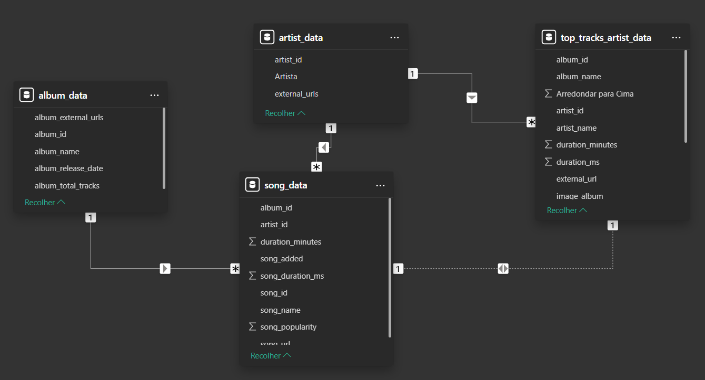

## Analysis Dashboard in Power BI:

To finalize the project, I built a comprehensive dashboard analyzing **(1)** the Top 50 Global playlist and **(2)** the historical hits of the artists featured in the playlist.

Cover Page of the **Spotify API Dashboard** in **Power BI**:

https://github.com/jv-mendes07/api_spotify_etl_power_bi/assets/d3f4fadc-65eb-4210-a91b-277449135532

Analysis Page of the **Top 50 Global Playlist**:

https://github.com/jv-mendes07/api_spotify_etl_power_bi/assets/d93a96e9-07ec-44ad-8965-350b1b6b0530

Analysis Page of the Hit History for the Selected Artist from the **Top 50 Global Playlist Analysis Page**:

https://github.com/jv-mendes07/api_spotify_etl_power_bi/assets/93790271/975dbb09-409c-47d1-86cf-491250f6ac81

Dashboard Link: https://abrir.link/olSmK

## Final Considerations:

In summary, this project utilizes various **AWS** cloud services, including **Lambda**, **S3**, and **CloudWatch**, to extract data from the **Spotify API** and transform it using **Python**. The data is then structured into fact and dimension tables modeled in **Snowflake**. Finally, I connect to **Power BI** to analyze the **Top 50 Global Playlist** and the hit history of the artists featured in the playlist.
