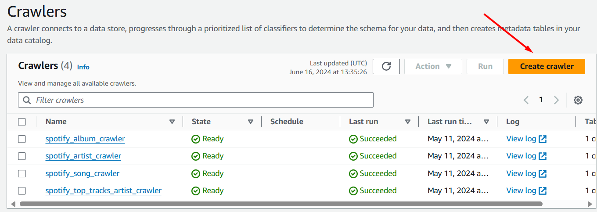
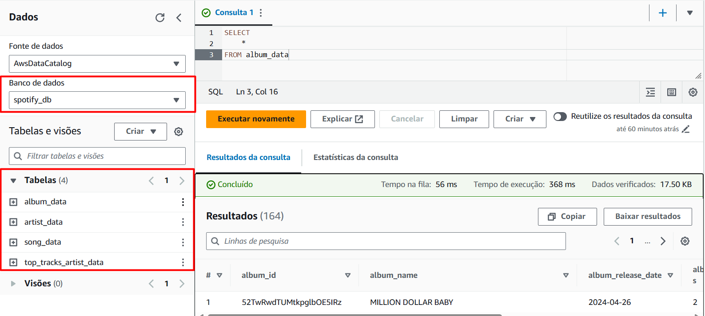
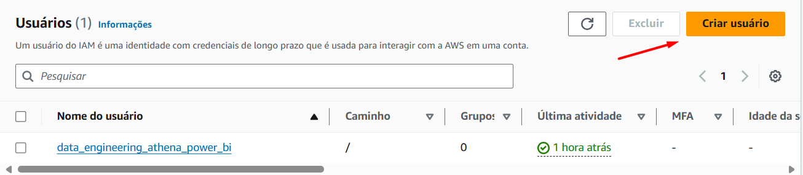
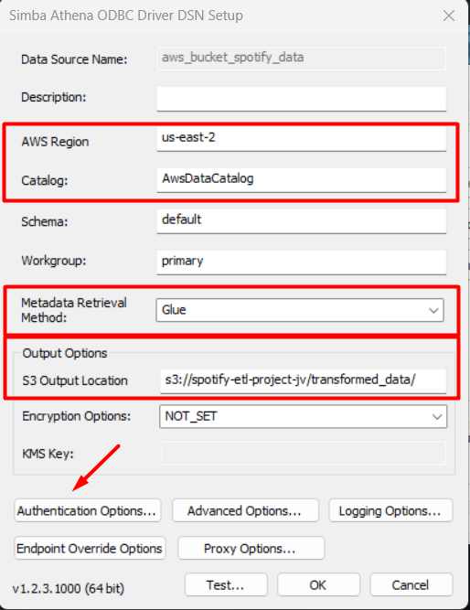
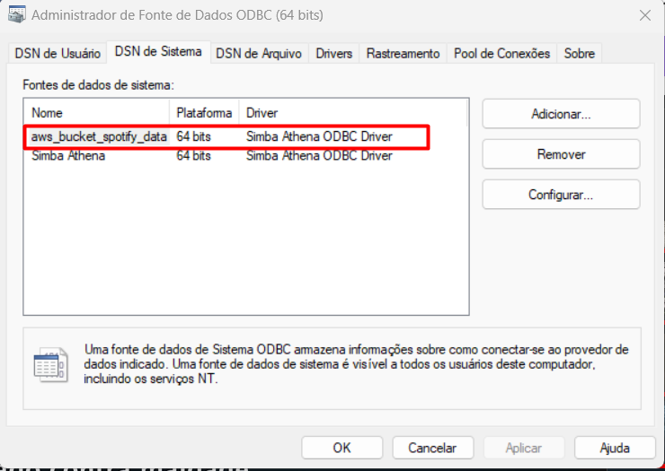

# Projeto de ETL com a API do Spotify, Lambda, CloudWatch, S3, Athena & Power BI

Em meu projeto de engenharia de dados, uso o **CloudWatch** e **AWS Lambda** em **Python** para extrair dados da **API do Spotify** semanalmente e armazená-los em um **bucket** do **S3**. Em seguida, um segundo **Lambda** transforma os dados **JSON** brutos em **CSV**, que são armazenados em outro **bucket** do **S3**. O **AWS Catalog** cria o schema dos metadados dos arquivos **CSV** para consulta no **AWS Athena**. Conecto-me ao **Athena** via **ODBC** para extrair os dados para o **Power BI**, onde analiso a playlist das 50 músicas mais ouvidas globalmente e o histórico de hits dos artistas presentes na playlist.

A arquitetura do projeto original do curso **Python For Data Engineering** do **Darshil Parmar** é essa:


Porém, reformulei o projeto com a adição do **ODBC** e do **Power BI** para realizar toda a análise de dados da **playlist** das **Top 50 músicas do globo** e dos artistas contidos em tal **playlist**.

## Bucket no AWS S3:

Primeiramente, criei o **bucket** **spotify-etl-project-jv** no **S3** para armazenar às extrações e às transformações dos dados semi-estruturados da **API do Spotify**:


Depois criei mais duas pastas em tal **bucket**, uma pasta **processed** com o histórico de arquivos **JSON** processados e transformados da **API do Spotify**, e outra pasta **to_processed** com arquivos **JSON** novos da **API do Spotify** para serem processados pela função **Lambda** do **AWS** com **Python**:


Nas pastas **processed** e **to_processed** há mais duas sub-pastas **data_playlist_tracks_raw** para armazenar os dados brutos em formato **JSON** da playlist das 50 músicas globalmente mais ouvidas e **top_tracks_artist_raw** para armazenar os dados brutos em formato **JSON** do histórico de **hits** dos artistas que estão presentes em tal playlist.


Abaixo, um exemplo dos arquivos **JSON** de dados brutos extraídos da **API do Spotify** armazenados no **bucket** **processed** do **S3**:


## Funções no AWS Lambda:

#### Extração de dados da API do Spotify

Na fase de extração dos dados brutos da **API do Spotify**, criei uma **Pipeline** no **AWS Lambda** que usa o **(1)** **CloudWatch** para acionar o **Lambda** em **Python** para extrair os dados da **API do Spotify** e descarrega-los no formato **JSON** na pasta **to_processed** do **bucket** **spotify-etl-project-jv** no **S3**:


Configurei a **trigger** no **CloudWatch** para executar a função **Lambda** de extração de dados da **API do Spotify** semanalmente:


Para executar a função **Lambda** de extração, configurei variáveis de ambiente para armazenar os segredos de acesso da **API do Spotify** e adicionei a camada do pacote **spotipy** para o **AWS Lambda** poder usar a biblioteca de conexão à **API do Spotify**:

**Variáveis de ambiente** 


**Spotipy Pacote**


Por fim, coloquei o código **Python** no **AWS Lambda** para extrair os dados brutos e semi-estruturados no formato **JSON** da **playlist** das Top 50 músicas globais e dos **hits** dos artistas de tal **playlist**:
```
import json
import os
import spotipy
from spotipy.oauth2 import SpotifyClientCredentials
import boto3
from datetime import datetime

def lambda_handler(event, context):
    
    client_id = os.environ.get('client_id')
    client_secret = os.environ.get('client_secret')
    
    client_credentials_manager = SpotifyClientCredentials(
    client_id = client_id,
    client_secret = client_secret
        )
        
    sp = spotipy.Spotify(client_credentials_manager = client_credentials_manager)
    
    playlist_link = 'https://open.spotify.com/playlist/37i9dQZEVXbMDoHDwVN2tF'
    playlist_URI = playlist_link.split('/')[-1]
    data_playlist_tracks = sp.playlist_tracks(playlist_URI)
    
    client = boto3.client('s3')
    
    artists_ids = []
    for row in data_playlist_tracks['items']:
        for key, value in row.items():
            if key == 'track':
                for artist in value['artists']:
                    artist_id = artist['id']
                    artists_ids.append(artist_id)
                    
    for artist in set(artists_ids):
        
        data_top_tracks_artist = sp.artist_top_tracks(artist)
        
        filename = 'raw_data_top_tracks_artist_' + artist + '_' + str(datetime.now()) + '.json'
        
        client.put_object(
            Bucket = 'spotify-etl-project-jv',
            Key = 'raw_data/to_processed/top_tracks_artist_raw/' + filename,
            Body = json.dumps(data_top_tracks_artist)
            
            )
        
    filename = 'spotify_raw_data_playlist_tracks_' + str(datetime.now()) + '.json'
    
    client.put_object(
        Bucket = 'spotify-etl-project-jv',
        Key = 'raw_data/to_processed/data_playlist_tracks_raw/' + filename,
        Body = json.dumps(data_playlist_tracks)
        )
```
#### Transformação de dados da API do Spotify

Na segunda fase, criei uma **Pipeline** no **AWS Lambda** que transforma os dados da **API do Spotify** quando novos arquivos **JSON** são carregados na pasta **to_processed** no **bucket** do **S3**. A **trigger** para o **AWS Lambda** é o evento de criação de novos arquivos **JSON** nessa pasta, indicando que há dados para serem processados e transformados.


Configurei a **trigger** com um evento do **S3** para executar a função **Lambda** de transformação de dados da **API do Spotify** após haver o carregamento de novos arquivos **JSON** disponíveis na pasta **to_processed**:


Para executar a função **Lambda** de transformação, adicionei uma camada do pacote **Pandas** para o **AWS Lambda** poder usar a biblioteca **Pandas** para manipular e transformar os dados da **API do Spotify**.

**Pandas Pacote**


Depois, coloquei o código **Python** no **AWS Lambda** para transformar os dados brutos e semi-estruturados da **playlist** das Top 50 músicas globais e dos **hits** dos artistas de tal **playlist**, para normalizar os dados em formato **JSON** para o formato tabular em **CSV**, para disponibilizar tais dados na pasta **transformed_data** do **bucket** no **S3**:

```
import json
import boto3
import pandas as pd
from datetime import datetime
import os
from io import StringIO


def albums(data):
    album_list = []
    for row in data['items']:
    
        album_id = row['track']['album']['id']
        album_name = row['track']['album']['name']
        album_release_date = row['track']['album']['release_date']
        album_total_tracks = row['track']['album']['total_tracks']
        album_external_urls = row['track']['album']['external_urls']['spotify']
        album_element = {
                'album_id': album_id, 'album_name': album_name, 'album_release_date': album_release_date,
                'album_total_tracks': album_total_tracks, 'album_external_urls': album_external_urls
                }
        album_list.append(album_element)
    
    return album_list
    
def artists(data):
    artist_list = []
    for row in data['items']:
        for key, value in row.items():
            if key == 'track':
                for artist in value['artists']:
                    artist_dict = {'artist_id': artist['id'], 'artist_name': artist['name'], 'external_urls': artist['external_urls']['spotify']}
                    artist_list.append(artist_dict)
                    
    return artist_list
    
def songs(data):
    song_list = []
    for row in data['items']:
        song_id = row['track']['id']
        song_name = row['track']['name']
        song_duration_ms = row['track']['duration_ms']
        song_url = row['track']['external_urls']['spotify']
        song_popularity = row['track']['popularity']
        song_added = row['added_at']
        album_id = row['track']['album']['id']
        artist_id = row['track']['album']['artists'][0]['id']
        song_element = {'song_id': song_id, 'song_name': song_name, 'song_duration_ms': song_duration_ms,
                       'song_url': song_url, 'song_popularity': song_popularity, 'song_added': song_added,
                       'album_id': album_id, 'artist_id': artist_id}
        song_list.append(song_element)
        
    return song_list

def top_tracks_artist(data):
    
    top_tracks_artist_list = []
    
    for top_track in data['tracks']:
        
        artist_id = top_track['artists'][0]['id']
        artist_name = top_track['artists'][0]['name']
        track_name = top_track['name']
        popularity = top_track['popularity']
        duration_ms = top_track['duration_ms']
        song_id = top_track['id']
        album_name = top_track['album']['name']
        total_tracks = top_track['album']['total_tracks']
        album_id = top_track['album']['id']
        release_date = top_track['album']['release_date']
        image_album = top_track['album']['images'][0]['url']
        external_url = top_track['external_urls']['spotify']
        top_tracks_artist = {
            'artist_id': artist_id, 'artist_name': artist_name, 'track_name': track_name, 'popularity': popularity,
            'duration_ms': duration_ms, 'song_id': song_id, 'album_name': album_name, 'total_tracks': total_tracks,
            'album_id': album_id, 'release_date': release_date, 'image_album': image_album, 'external_url': external_url
        }
        
        top_tracks_artist_list.append(top_tracks_artist)
        
    return top_tracks_artist_list


def lambda_handler(event, context):
    
    s3 = boto3.client('s3')
    Bucket = 'spotify-etl-project-jv'
    key_data_playlist_tracks_raw = 'raw_data/to_processed/data_playlist_tracks_raw/'
    key_data_top_tracks_artist = 'raw_data/to_processed/top_tracks_artist_raw/'
    
    spotify_playlist_tracks_data = []
    spotify_playlist_tracks_key = []
    
    spotify_top_tracks_artist_data = []
    spotify_top_tracks_artist_key = []
    
    for file_playlist_tracks in s3.list_objects(Bucket = Bucket, Prefix = key_data_playlist_tracks_raw)['Contents']:
        
        file_playlist_track_key = file_playlist_tracks['Key']

        if (file_playlist_track_key.split('.')[-1] == 'json'):
            
            response = s3.get_object(Bucket = Bucket, Key = file_playlist_track_key)
            content = response['Body']
            jsonObject = json.loads(content.read())
            spotify_playlist_tracks_data.append(jsonObject)
            spotify_playlist_tracks_key.append(file_playlist_track_key)
    
    for file_top_tracks_artist in s3.list_objects(Bucket = Bucket, Prefix = key_data_top_tracks_artist)['Contents']:
        
        file_top_tracks_artist_key = file_top_tracks_artist['Key']

        if (file_top_tracks_artist_key.split('.')[-1] == 'json'):
            
            response = s3.get_object(Bucket = Bucket, Key = file_top_tracks_artist_key)
            content = response['Body']
            jsonObject = json.loads(content.read())
            spotify_top_tracks_artist_data.append(jsonObject)
            spotify_top_tracks_artist_key.append(file_top_tracks_artist_key)    
            
    for data in spotify_playlist_tracks_data:
        
        album_list = albums(data)
        song_list = songs(data)
        artist_list = artists(data)

        album_df = pd.DataFrame.from_dict(album_list)
        album_df = album_df.applymap(lambda x: x.strip().replace('"', '') if isinstance(x, str) else x)
        album_df = album_df.drop_duplicates(subset = ['album_id'])
        
        artist_df = pd.DataFrame.from_dict(artist_list)
        artist_df = artist_df.applymap(lambda x: x.strip().replace('"', '') if isinstance(x, str) else x)
        artist_df = artist_df.drop_duplicates(subset = ['artist_id'])
        
        song_df = pd.DataFrame.from_dict(song_list)
        song_df = song_df.applymap(lambda x: x.strip().replace('"', '') if isinstance(x, str) else x)
        song_df = song_df.drop_duplicates()

        album_df['album_release_date'] = pd.to_datetime(album_df['album_release_date'])
        song_df['song_added'] = pd.to_datetime(song_df['song_added'])
        
        song_key = 'transformed_data/song_data/songs_transformed_' + str(datetime.now()) + '.csv'
        song_buffer = StringIO()
        song_df.to_csv(song_buffer, index = False, sep = ';')
        song_content = song_buffer.getvalue()
        s3.put_object(Bucket = Bucket, Key = song_key, Body = song_content)
        
        artist_key = 'transformed_data/artist_data/artist_transformed_' + str(datetime.now()) + '.csv'
        artist_buffer = StringIO()
        artist_df.to_csv(artist_buffer, index = False, sep = ';')
        artist_content = artist_buffer.getvalue()
        s3.put_object(Bucket = Bucket, Key = artist_key, Body = artist_content)
        
        album_key = 'transformed_data/album_data/album_transformed_' + str(datetime.now()) + '.csv'
        album_buffer = StringIO()
        album_df.to_csv(album_buffer, index = False, sep = ';')
        album_content = album_buffer.getvalue()
        s3.put_object(Bucket = Bucket, Key = album_key, Body = album_content)
        
    concatenated_top_tracks_artist_df = pd.DataFrame()
        
    for data in spotify_top_tracks_artist_data:
        
        top_tracks_artist_list = top_tracks_artist(data)
        
        top_tracks_artist_df = pd.DataFrame.from_dict(top_tracks_artist_list)
        
        concatenated_top_tracks_artist_df = pd.concat([concatenated_top_tracks_artist_df, top_tracks_artist_df])
        concatenated_top_tracks_artist_df = concatenated_top_tracks_artist_df.applymap(lambda x: x.strip().replace('"', '') if isinstance(x, str) else x)
        concatenated_top_tracks_artist_df = concatenated_top_tracks_artist_df.drop_duplicates()
        
    top_tracks_artist_key = 'transformed_data/top_tracks_artist_data/top_tracks_artist_transformed_' + str(datetime.now()) + '.csv'
    top_tracks_artist_buffer = StringIO()
    concatenated_top_tracks_artist_df.to_csv(top_tracks_artist_buffer, index = False, sep = ';')
    top_tracks_artist_content = top_tracks_artist_buffer.getvalue()
    s3.put_object(Bucket = Bucket, Key = top_tracks_artist_key, Body = top_tracks_artist_content)
        
    s3_resource = boto3.resource('s3')
    
    for key in spotify_playlist_tracks_key:
        
        copy_source = {
            'Bucket': Bucket,
            'Key': key
        }
        
        s3_resource.meta.client.copy(copy_source, Bucket, 'raw_data/processed/data_playlist_tracks_raw/' + key.split('/')[-1])
        s3_resource.Object(Bucket, key).delete()
        
    for key in spotify_top_tracks_artist_key:
        
        copy_source = {
            'Bucket': Bucket,
            'Key': key
        }
        
        s3_resource.meta.client.copy(copy_source, Bucket, 'raw_data/processed/top_tracks_artist_raw/' + key.split('/')[-1])
        s3_resource.Object(Bucket, key).delete()
```
Na pasta **transformed_data**, os arquivos **CSV** são separados por arquivos de **álbuns**, **artistas**, **músicas** e **hits dos artistas** em sub-pastas no **bucket** do **S3**:


## Catálogo de dados no AWS Crawler:

Com os arquivos **CSV** transformados da **API do Spotify**, criei **crawlers** no **AWS Crawler** para catalogar os dados dos arquivos **CSV** da sub-pasta **transformed_data**. Cada **crawler** transforma esses arquivos **CSV** em tabelas, definindo nomes e tipos de dados das colunas para consultas **SQL** no **AWS Athena**.



Com o catálogo de dados, consegui realizar consultas analíticas com linguagem **SQL** no **AWS Athena**:



## Conexão via ODBC:

Depois configurei uma conexão via **ODBC** para extrair os dados de tais tabelas de **músicas**, **artistas** e **álbuns** da **playlist** das Top 50 músicas e da tabela de **hits dos artistas** que estão em tal **playlist** disponibilizados no **AWS Athena**.

Criei um usuário no **IAM Role** para ter credenciais de acessso ao **AWS Athena** pelo **Power BI**:



Com o usuário no **IAM Role**, configurei a conexão no **ODBC** com a região do **AWS**, o caminho do **bucket** no **S3** e às credenciais de acesso ao **AWS Athena**.

#### Configuração de conexão via ODBC



#### Conexão via ODBC



## Dashboard de análise no Power BI:

Para finalizar o projeto, construi um **dashboard** completo de análise **(1)** da **playlist** das 50 músicas globalmente mais ouvidas e dos **(2)** hits históricos dos artistas presentes em tal **playlist**.

A capa do **dashboard** da **API do Spotify** no **Power BI**:

https://github.com/jv-mendes07/api_spotify_etl_power_bi/assets/93790271/eda99aa9-55e0-4633-83b2-25e748674e95

A página da análise da **playlist** das Top 50 músicas globais:

https://github.com/jv-mendes07/api_spotify_etl_power_bi/assets/93790271/287070fa-e7af-4f29-a9f6-1a067ab4a950

A página da análise do histórico de **hits** do artista selecionado na página de análise da **playlist** das Top 50 músicas globais:

https://github.com/jv-mendes07/api_spotify_etl_power_bi/assets/93790271/9b56153f-a219-4e57-93a6-28cf71eaaf35

## Considerações finais:

Em suma, em tal projeto uso vários serviços da nuvem da **AWS** como o **Lambda**, **S3**, **CloudWatch**, **Athena** e **AWS Crawler** para extrair os dados da **API do Spotify** e transforma-los em **Python** para disponibiliza-los em tabelas no **Glue** com o catálogo de dados (metadados, schema) no **AWS Catalog**, para depois conectar-me no **Athena** via **ODBC** pelo **Power BI** para analisar a **playlist** das Top 50 músicas globais e do histórico de **hits** dos artistas de tal **playlist**.
