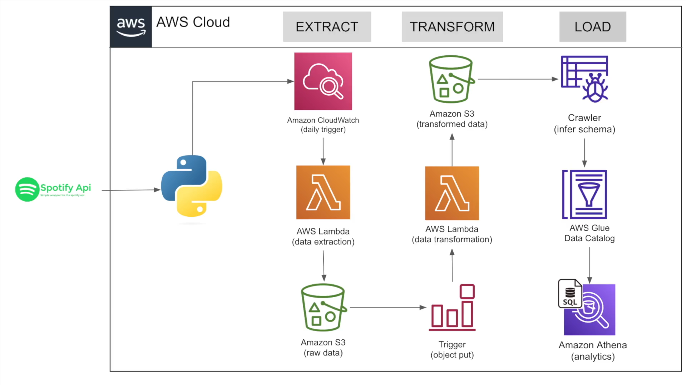

# Projeto de ETL com a API do Spotify, Lambda, CloudWatch, S3, Athena & Power BI

Em meu projeto de engenharia de dados, uso o **CloudWatch** e **AWS Lambda** em **Python** para extrair dados da **API do Spotify** semanalmente e armazená-los em um **bucket** do **S3**. Em seguida, um segundo **Lambda** transforma os dados **JSON** brutos em **CSV**, que são armazenados em outro **bucket** do **S3**. O **AWS Catalog** cria o schema dos metadados dos arquivos **CSV** para consulta no **AWS Athena**. Conecto-me ao **Athena** via **ODBC** para extrair os dados para o **Power BI**, onde analiso a playlist das 50 músicas mais ouvidas globalmente e o histórico de hits dos artistas presentes na playlist.

A arquitetura do projeto original do curso **Python For Data Engineering** do **Darshil Parmar** é essa:

Porém, reformulei o projeto com a adição do **ODBC** e do **Power BI** para realizar toda a análise de dados da **playlist** das **Top 50 músicas do globo** e dos artistas contidos em tal **playlist**.

## Bucket no AWS S3:

Primeiramente, criei o **bucket** **spotify-etl-project-jv** no **S3** para armazenar às extrações e às transformações dos dados semi-estruturados da **API do Spotify**:

Depois criei mais duas pastas em tal **bucket**, uma pasta **processed** com o histórico de arquivos **JSON** processados e transformados da **API do Spotify**, e outra pasta **to_processed** com arquivos **JSON** novos da **API do Spotify** para serem processados pela função **Lambda** do **AWS** com **Python**:

Nas pastas **processed** e **to_processed** há mais duas sub-pastas **data_playlist_tracks_raw** para armazenar os dados brutos em formato **JSON** da playlist das 50 músicas globalmente mais ouvidas e **top_tracks_artist_raw** para armazenar os dados brutos em formato **JSON** do histórico de **hits** dos artistas que estão presentes em tal playlist.

Abaixo, um exemplo dos arquivos **JSON** de dados brutos extraídos da **API do Spotify** armazenados no **bucket** **processed** do **S3**:

## Funções no AWS Lambda:

#### Extração de dados da API do Spotify

Na fase de extração dos dados brutos da **API do Spotify**, criei uma **Pipeline** no **AWS Lambda** que usa o **(1)** **CloudWatch** para acionar o **Lambda** em **Python** para extrair os dados da **API do Spotify** e descarrega-los no formato **JSON** na pasta **to_processed** do **bucket** **spotify-etl-project-jv** no **S3**:

